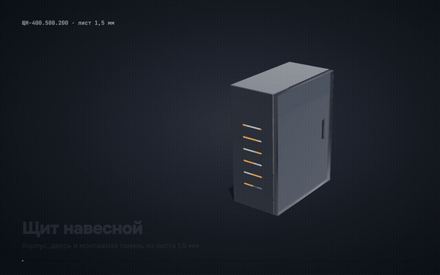
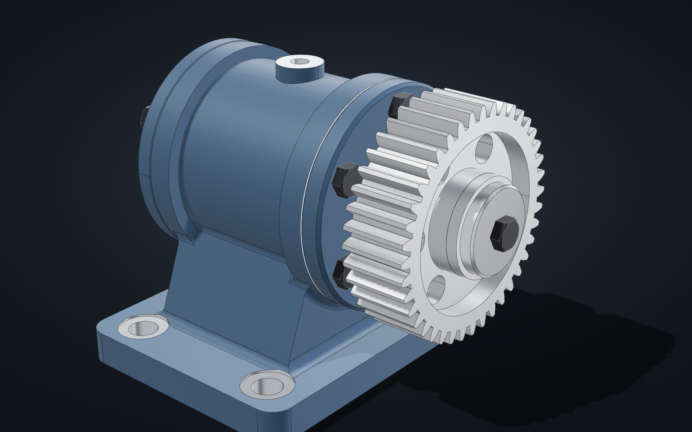
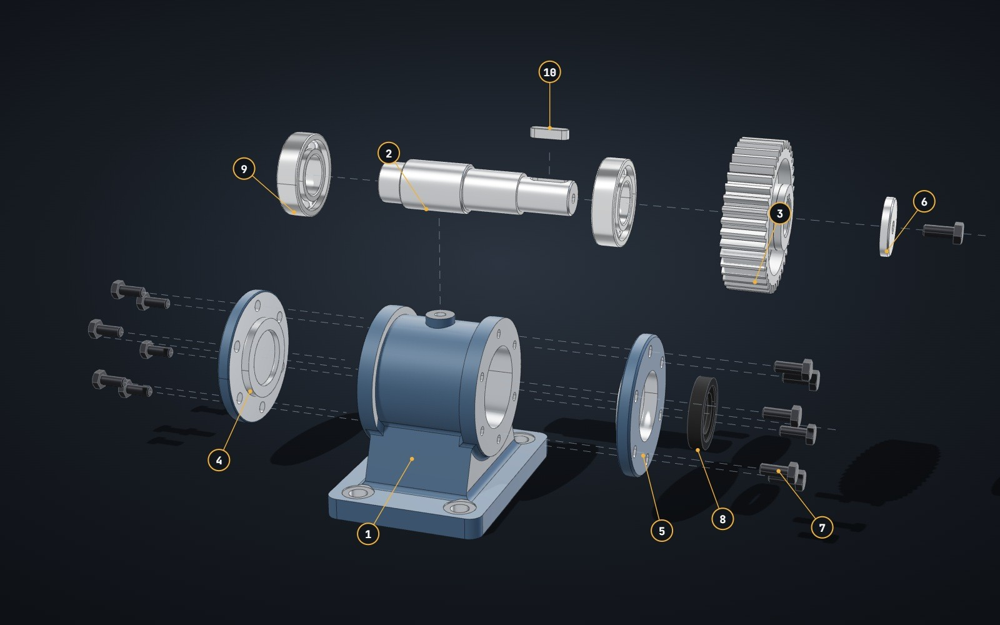
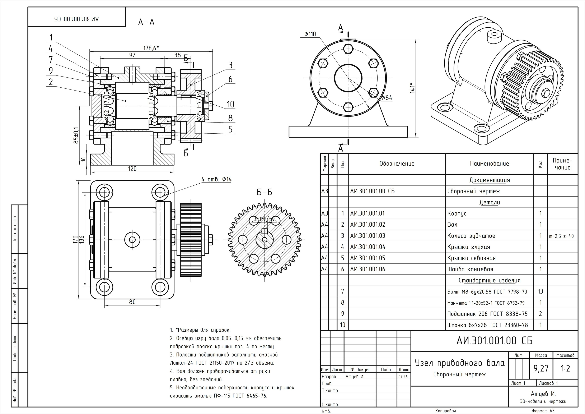
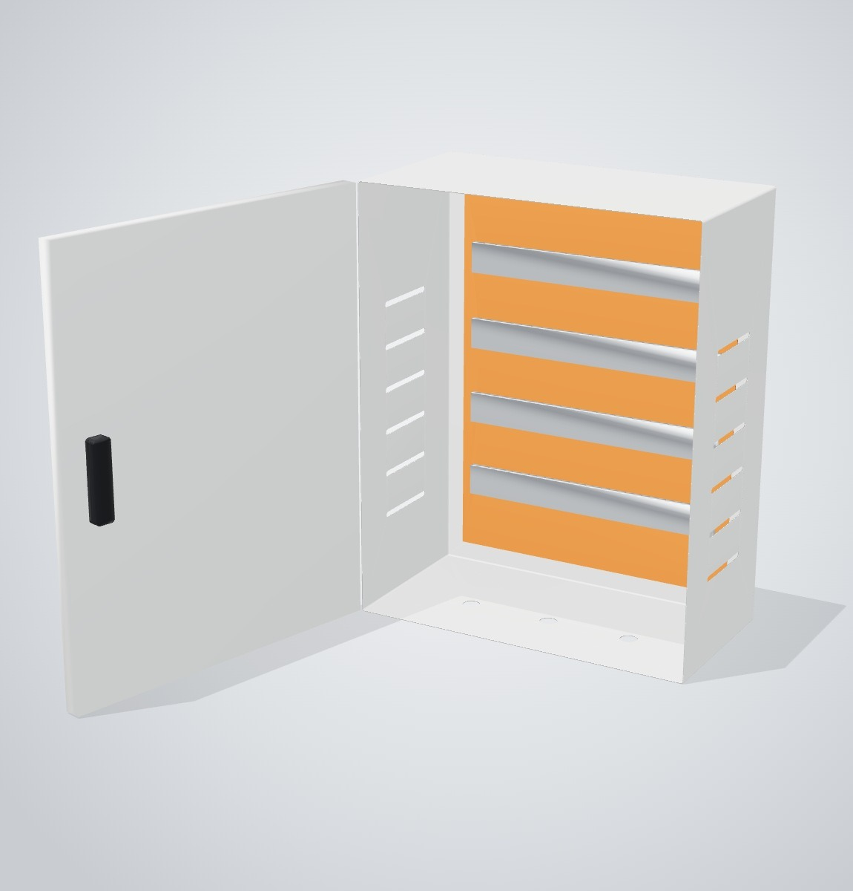
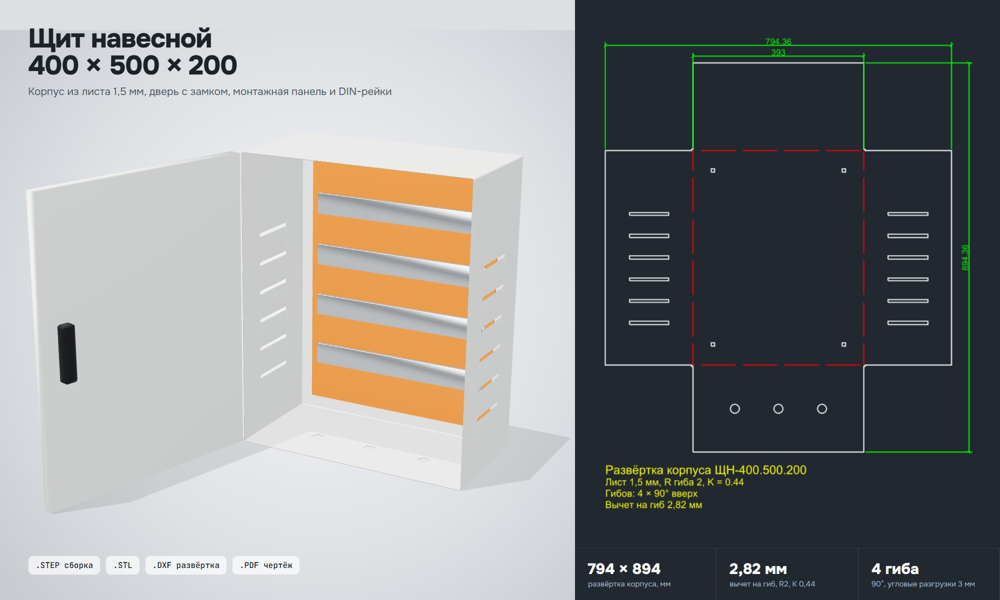
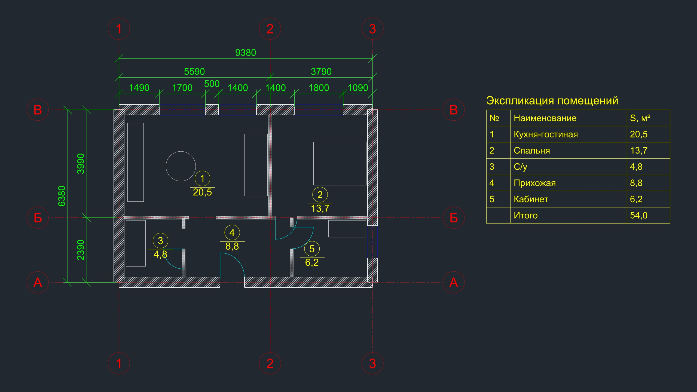
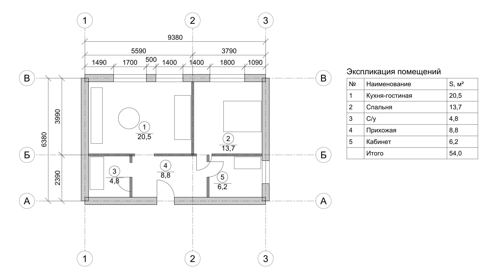

# cad-engineering

Конструирование кодом: параметрические 3D-модели, чертежи в стиле ЕСКД и развёртки,
построенные на CadQuery, OpenCascade и ezdxf. Меняете параметр, запускаете скрипт заново и
получаете новые STEP, STL, DXF и SVG.



## gear-drive-assembly

Сборочная единица вала из десяти деталей: корпус, вал, прямозубое колесо, два подшипника
206, крышки, шпонка и крепёж.

- `model.py` строит каждую деталь параметрически и выгружает STEP, STL и GLB
- `drawing.py` проецирует сборку с удалением невидимых линий и формирует сборочный чертёж
  А3 с размерами, позициями, основной надписью и спецификацией в DXF и SVG
- `bom.json` питает и чертёж, и спецификацию

| Рендер | Разнесённый вид | Сборочный чертёж А3 |
|---|---|---|
|  |  |  |

## sheet-metal-cabinet

Электротехнический шкаф из листовой стали 1,5 мм с навесной дверью, монтажной панелью и
DIN-рейками.

- корпус построен как гнутая оболочка, а не сплошной блок
- развёртка для лазерной резки рассчитана с учётом K-фактора и выгружена в DXF с линиями гиба
- анимация открывания двери в браузере на Three.js

| 3D | Развёртка |
|---|---|
|  |  |

## autocad-floor-plan

План квартиры 54 м², сразу сгенерированный в DXF: стены на своих слоях, двери и окна
блоками, размеры в нужном масштабе, площади помещений и лист в пространстве листа, готовый к
печати.

| Пространство модели | Пространство листа |
|---|---|
|  |  |

## bracket

Параметрический кронштейн со скруглениями и отверстиями под цековку, выгрузка в STEP, STL,
GLB и четыре ортогональных вида в SVG.

## Стек

CadQuery, OpenCascade (OCP), ezdxf, trimesh, numpy, matplotlib, Three.js для предпросмотра
в браузере. Файлы открываются в SolidWorks, КОМПАС-3D, AutoCAD и FreeCAD.

```bash
pip install -r requirements.txt
python gear-drive-assembly/model.py && python gear-drive-assembly/drawing.py
python sheet-metal-cabinet/enclosure.py
python autocad-floor-plan/plan_dwg.py
```
